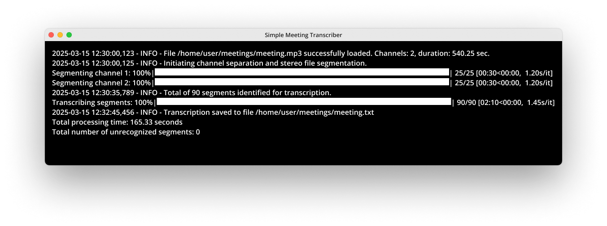

# Simple Meeting Transcriber

Ever spent hours trying to remember meeting details or transcribing some notes by-hand? I built this tool because I was tired of doing exactly that! This Python script runs **entirely on your device** — no cloud services, no API keys, and no internet connection required (after you download the model file). It uses the lightning-fast [whisper.cpp](https://github.com/ggerganov/whisper.cpp/) to transcribe your voice recordings, with special handling for meeting recordings that include speaker separation.



## What This Tool Does

- Runs fully offline – No API, no cloud processing, just fast on-device transcription
- Turns your meeting recordings into readable text
- Detects different speakers in stereo meeting recordings
- Breaks down audio by chunks using silence detection
- Speeds things up with parallel processing
- Lets you customize the transcription process through simple settings
- Shows you some progress bars so you're not left wondering if it's stuck
- Identifies problematic audio sections so you can troubleshoot (if needed)

## Why I Built This

I chose whisper.cpp for its impressive speed, especially on Mac M1 chips. While I built this primarily for Zoom meetings, it actually works with any voice recording. I've tested it on Mac, though it should work cross-platform.

## Requirements

- Python 3.10 or newer
- [whisper.cpp](https://github.com/ggerganov/whisper.cpp) compiled with whisper-cli binary
- A Whisper model file (e.g., `ggml-large-v3-turbo.bin`)
- Required Python packages: pydub, tqdm

## Installation

1. Clone this repository
2. Install required dependencies:

```bash
pip install -r requirements.txt
```

3. Build and compile whisper.cpp (follow their [docs](https://github.com/ggerganov/whisper.cpp/blob/master/README.md) for instructions)
4. Download a Whisper model file from the [whisper.cpp repository](https://github.com/ggerganov/whisper.cpp/blob/master/models/README.md)
5. You **must** create a `config.ini` file in the /src directory before running the script
6. Run the script from the /src directory

## Configuration

Before running the script, you **must** create a `config.ini` file inside the /src folder. This file allows you to customize the transcription settings. Here’s an example configuration file:

```ini
[paths]
whisper_cli = /path/to/whisper-cli # Your path to the whisper-cli executable
model = /path/to/models/ggml-large-v3-turbo.bin # Path to the whisper model file (e.g., ggml-large-v3-turbo.bin)

[settings]
silence_min_len = 500
silence_thresh = -20
merge_gap = 1000
language = en
threads = 4
temperature = 0.0
temperature_inc = 0.2
best_of = 5
beam_size = 5
```

## Usage

Basic usage (using your config file settings):

```bash
python src/main.py /path/to/meeting_recording.mp3
```

With custom paths:

```bash
python src/main.py /path/to/meeting_recording.mp3 --cli ./path/to/whisper-cli --model ./path/to/model.bin
```

Additional options:

```bash
# Include error messages in the transcript text file
python src/main.py /path/to/meeting_recording.mp3 --include-errors

# Save audio snippets that couldn't be transcribed (for debugging)
python src/main.py /path/to/meeting_recording.mp3 --save-errors

# Process the whole file without breaking it into smaller chunks
python src/main.py /path/to/meeting_recording.mp3 --no-segmentation
```
## What You'll Get

A text file with your transcription (same name as the input file), including participant labels for stereo recordings:

```
[Participant 1] — Hello everyone, and we need to ship this feature by Thursday, just as I said.
[Participant 2] — Today IS Thursday.
[Participant 1] — Uhm...
[Participant 1] — I'd like to revise my previous statement.
```

## Notes and Limitations

- **Memory usage:** Bigger models = better results, but more RAM needed
- **Processing time:** Long recordings will take time (be patient!)
- **Audio quality matters:** Clear audio with minimal background noise works best
- **Language setting:** Make sure to set the right language in your config
- **Speaker detection:** Works automatically in stereo recordings (typically one speaker in the left channel and another in the right channel), but can't identify individuals in mono recordings
- **CPU usage:** Adjust the `threads` setting based on your computer's capabilities

## Troubleshooting

- **Too many short segments?** Try increasing `silence_min_len` and `merge_gap` values
- **Noisy recording?** Adjust `silence_thresh` to better detect actual pauses
- **Poor quality sections?** Check the `error_segments` folder (when using `--save-errors`)
- **Overall transcription quality issues?** Try a larger model or adjust temperature settings
- **Transcription is too slow?** A powerful CPU with multiple cores and adequate RAM will significantly speed up transcription, especially for long recordings.

## Why Not tinydiarize?

I chose not to use **tinydiarize** for speaker segmentation mostly because it is still **experimental**. It also requires a specific model variant to work. Instead, this tool relies on my own method of **stereo-based speaker separation**, which I believe is more reliable and efficient for transcribing Zoom meetings and other multi-speaker recordings.

If you’d like to experiment with **tinydiarize**, you can use a **compatible Whisper model** (e.g., `ggml-small.en-tdrz.bin`) and modify this script to include the `-tdrz` argument in the whisper-cli command.

## Kudos

This project wouldn't be possible without the incredible work of [Georgi Gerganov](https://github.com/ggerganov) and his fantastic open-source project [whisper.cpp](https://github.com/ggerganov/whisper.cpp). His dedication to bringing Whisper to a fast, efficient C++ implementation has made this tool feasible. Huge thanks to Georgi and the open-source community for making speech-to-text transcription more accessible!

## Disclaimer

**Important:** Please ensure that you have obtained the necessary consent from all meeting participants before recording and transcribing meetings. Recording without consent may be illegal or unethical depending on your location. Always follow local laws and organizational policies regarding audio recordings and transcription.

This tool is provided "as-is" without any guarantees. Use it responsibly and ethically!

## License

This project is licensed under the terms of the MIT license.

## Contributing

Found a bug? Have an idea for improvement? I'd love your input! Feel free to:
- Open an issue
- Submit a pull request
- Fork the project for your own needs

I can't promise frequent updates, but I do review contributions when I can.

---

Made with ❤️ by a developer who was tired of manually transcribing Zoom meetings